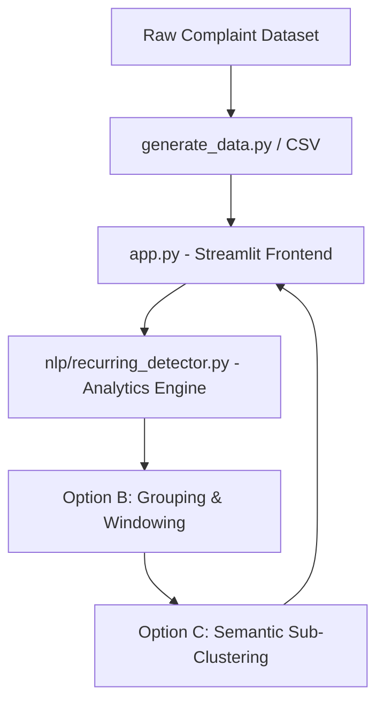

# Recurring Issue Detection Module Design & Integration Plan

This document outlines the detailed analysis and proposed implementation plan for integrating a **Recurring Issue Detection** module into the Water Infrastructure Intelligence System. This module transitions the project from a reactive NLP classification tool into a proactive urban water utility analytics system.

---

## User Review Required

> [!IMPORTANT]
> **Aesthetic and UX Alignment**
> The introduction of the Recurring Issue Detection module will add a new tab to the Streamlit sidebar. To maintain a premium look, we should use clean, responsive components (e.g., `st.metric`, custom HTML cards, and interactive Plotly figures) rather than simple dataframes.

> [!NOTE]
> **Performance Consideration with Sentence-BERT**
> Option C (Semantic Similarity clustering) requires running Sentence-BERT embeddings. Generating embeddings for 15,000 complaints dynamically in Streamlit would cause severe latency. The proposed solution recommends using **Option B (Pandas-based Location + Category + Time Window)** as the primary filtering mechanism, and only running **Option C (Semantic Similarity)** on-demand on the filtered subsets.

---

## Open Questions

> [!NOTE]
> **Configurability of Thresholds**
> Should thresholds (e.g., time window, minimum complaint count) be strictly hardcoded based on category, or should we expose interactive sliders in the Streamlit sidebar to let municipal operators adjust sensitivity dynamically?
> *Recommended approach: Expose them as sidebar sliders in Streamlit to maximize interactive value for an academic project.*

---

## Proposed Changes

We propose introducing a dedicated analytics module to keep the codebase clean, modular, and testable.



### Analytics and Core Engine

We will create a new Python module under the `nlp/` directory to house the detection and clustering logic.

#### [NEW] [recurring_detector.py](file:///c:/Users/rayal/water_complaint_analyzer/nlp/recurring_detector.py)

This file will contain functions to:
1. Parse and filter the dataset by rolling time windows.
2. Group complaints by location and category.
3. Compute recurring status based on dynamic/static thresholds.
4. Run semantic sub-clustering using Sentence-BERT and Cosine Similarity on active complaint groups.

---

### Dashboard Integration

We will modify the Streamlit web application to expose the new features.

#### [MODIFY] [app.py](file:///c:/Users/rayal/water_complaint_analyzer/app.py)

We will:
1. Add a new sidebar navigation option: `"Recurring Issues Dashboard"`.
2. Integrate interactive sidebar controls (sliders for time windows, count thresholds, and category weights).
3. Display metrics cards, interactive lists of active alerts, drill-down panels, and maps/charts.

---

## Detailed Analysis & Design Details

### 1. Functional Goal

A **Recurring Issue** is defined as:
* **Co-occurrence**: Multiple complaints sharing the same **Location** and predicted **Category** (or high semantic similarity).
* **Temporal Density**: The complaints must occur within a specific **Time Window** (e.g., the last 30 days).
* **Severity/Frequency**: The count of occurrences must exceed a defined **Threshold**.

#### Example Scenario
* **Location**: Jayanagar
* **Category**: Drainage Overflow
* **Occurrences in last 30 days**: 8
* **Status**: 🚨 Recurring Issue Detected
* **Actionable Insight**: Alert municipal engineers that there is likely a sewer blockage at Jayanagar, rather than isolated domestic drainage complaints.

---

### 2. Data Requirements

The current dataset columns generated by `generate_data.py` are:
1. `complaint_text`: Required for semantic similarity checks.
2. `category`: Required for grouping issues by category.
3. `priority`: Required for determining priority severity of recurring alerts.
4. `location`: Required for grouping issues by geography.
5. `date`: Required for rolling time-window calculations.

#### Are they sufficient?
**Yes, the current columns are sufficient.** However, in the processing pipeline, the `date` column (which is saved as a string `YYYY-MM-DD` in CSV) must be converted into Pandas `datetime` objects to perform rolling window queries and time delta filtering.

---

### 3. Detection Logic Options Comparison

Below is an evaluation of the three approaches for a 2-3 week academic NLP project:

| Metric / Dimension | Option A: Simple Frequency Counting | Option B: Location + Category + Time Window | Option C: Location + Category + Semantic Similarity |
| :--- | :--- | :--- | :--- |
| **Logic** | Counts total occurrences per location or category. | Group by location and category, then filter complaints within a rolling window (e.g., $N$ days). | Group by location and category, then use Sentence-BERT embeddings to cluster complaints that are semantically similar. |
| **Academic Value** | Low (basic database query style). | Medium (incorporates spatial and temporal context). | High (demonstrates modern NLP techniques and text embeddings). |
| **Complexity** | Extremely Low. | Low-Medium (Pandas grouping and date arithmetic). | High (Requires sentence-transformers library, clustering algorithms, and vector operations). |
| **Performance** | Extremely Fast. | Fast (millisecond latency on Pandas). | Slow (Calculating pairwise cosine similarities or DBSCAN clustering on 15k text items takes significant memory/time). |
| **Recommendation** | Not Recommended. | Recommended as the **core framework**. | Recommended as a **drill-down/hybrid extension**. |

#### Recommended Approach: The Hybrid Approach (Option B + Option C)
1. **First Pass (Option B)**: Group complaints by `location` and `category` within a sliding window (e.g., 30 days) using Pandas. Identify groups exceeding the frequency threshold (e.g., locations with $\ge 5$ leakage complaints).
2. **Second Pass (Option C)**: Within each flagged group (which usually has only 5 to 20 complaints), compute sentence embeddings using `Sentence-BERT (all-MiniLM-L6-v2)`. Group complaints with a cosine similarity $\ge 0.75$. This tells the operator, for example, that out of 8 leakage complaints in Jayanagar, 6 are referring to the *same* physical incident ("leak near 4th block bus stop") while 2 are unrelated.

This hybrid approach delivers **high academic NLP value** without sacrificing **computational performance** or usability.

---

### 4. Threshold Strategy

To make the system realistic, we propose a two-tiered threshold strategy:
1. **Global Default Thresholds**:
   * Rolling Time Window: **30 days**
   * Default Complaint Count: **5 complaints**
2. **Category-Specific Custom Thresholds** (since some issues are more critical than others):
   * **Contamination**: **3 complaints** (High public health hazard, triggers alarm faster).
   * **Leakage**: **4 complaints** (Resource waste risk).
   * **Drainage**: **4 complaints** (Flooding / sanitation risk).
   * **Supply**: **5 complaints** (Pressure/timing issues occur more frequently and are often resolved or tolerated longer).

*Note: Streamlit sliders will allow users to override these thresholds dynamically to test different system sensitivities.*

---

### 5. Integration Architecture

To ensure clean design, the codebase will be structured as follows:

```
water_complaint_analyzer/
│
├── nlp/
│   ├── __init__.py
│   ├── preprocessing.py         # Existing preprocessing logic
│   └── recurring_detector.py    # [NEW] Recurring issue & semantic grouping logic
│
├── models/                      # Saved models (.pkl)
│
├── app.py                       # [MODIFY] Streamlit Dashboard (invokes nlp/recurring_detector.py)
├── generate_data.py             # Existing data generation
├── train_model.py               # Existing model training
└── utils.py                     # Existing prediction utilities
```

**Why this is clean:**
* Keeps UI logic (`app.py`) separate from business logic (`recurring_detector.py`).
* Facilitates automated unit testing of the detection logic without needing to launch the Streamlit server.

---

### 6. Dashboard Mockup & Outputs

The Streamlit dashboard will feature a dedicated `"Recurring Issues Dashboard"` tab containing:
1. **KPI Cards**:
   * Total Active Complaints
   * Detected Recurring Issues (Alerts)
   * High-Risk Hotspots
2. **Top Recurring Issues Table**:
   * Sortable table showing: Location, Category, Count, Average Priority, Most Recent Date, Status.
3. **Interactive Filter Sidebar**:
   * Time Window Slider (e.g., 10 to 90 days).
   * Minimum Count Slider (e.g., 2 to 15 complaints).
   * Contamination Alert Override Toggle.
4. **Drill-down Inspector**:
   * When a row in the recurring issues table is selected, it displays all the raw complaint texts in that group.
   * Underneath, it highlights **Semantic Clusters** (e.g., grouping "Water dripping near main road Jayanagar" and "neeru leak agthide Jayanagar main road" as the same sub-issue).
5. **Interactive Charts**:
   * **Hotspot Ranker**: Plotly bar chart displaying the locations with the most recurring issues.
   * **Alert Timelines**: Trend line showing recurring issue alerts generated over the 6-month historical span.

---

### 7. Future Compatibility & Extensions

The proposed architecture easily scales to support the downstream components outlined in `description.md`:
* **Hotspot Ranking**: We can rank locations by computing a weighted frequency score based on the categories of recurring issues detected (e.g., Contamination gets a weight of 2.0, Supply gets 1.0).
* **Infrastructure Risk Score**: Calculate a score from 1-100 for each location by combining:
  $$\text{Risk Score} = w_1 \times (\text{Recurring Alert Count}) + w_2 \times (\text{Average Severity Level}) + w_3 \times (\text{Age of Oldest Active Issue})$$
* **Semantic Similarity Clustering**: We can apply DBSCAN to the sentence embeddings of the entire dataset to discover spatial-semantic hotspots that cross boundary names (e.g., detecting a boundary-crossing pipeline failure between HSR Layout and Marathahalli).

---

### 8. Implementation Roadmap

Estimated effort and complexity breakdown for a 2-3 week academic timeline:

```
[Phase 1: Logic & Tests] ======> [Phase 2: Semantic Engine] ======> [Phase 3: UI Dashboard]
      (Days 1 - 3)                    (Days 4 - 7)                    (Days 8 - 11)
```

1. **Phase 1: Analytics Logic & Unit Tests** (Estimated Effort: 3 days | Complexity: Low-Medium)
   * Create `nlp/recurring_detector.py`.
   * Implement date conversions and rolling-window aggregations in Pandas.
   * Write test scripts to verify the grouping counts.
2. **Phase 2: Semantic Similarity & Sub-Clustering** (Estimated Effort: 4 days | Complexity: High)
   * Implement Sentence-BERT embedding retrieval.
   * Build the Cosine Similarity thresholding function to cluster texts within location/category groups.
   * Optimize calculation using vector matrices to keep response times under 1 second.
3. **Phase 3: Streamlit Interface & Visualizations** (Estimated Effort: 4 days | Complexity: Medium)
   * Modify `app.py` to add the Sidebar navigator, Metrics Cards, and Alert Tables.
   * Implement interactive Plotly bar charts for hotspots and alert trends.
   * Build the drill-down panel for viewing raw complaints and semantic clusters.

---

## Verification Plan

### Automated Tests
1. **Unit tests in a new file `test_recurring.py`**:
   * Test with a mock dataframe containing specific dates, locations, and categories to verify that only complaints within the time window and exceeding the threshold are flagged.
   * Test the semantic clustering with pre-defined pairs (e.g. "pipe leak" vs "water leaking" vs "low pressure") to ensure similarity thresholding behaves correctly.

### Manual Verification
1. Run `streamlit run app.py` and navigate to the "Recurring Issues Dashboard".
2. Adjust the sliders (e.g., set time window to 30 days, threshold to 5) and verify that the table updates reactively.
3. Select an alert from the table, inspect the list of complaints, and confirm that semantic groupings match expected similarities.
